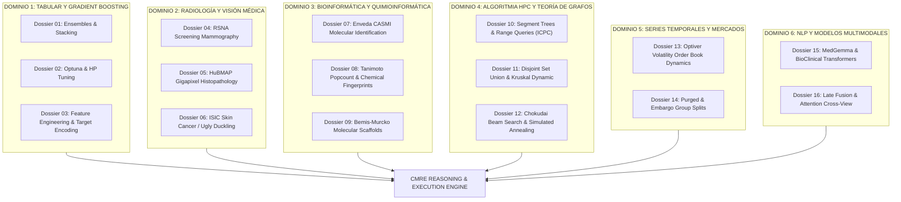
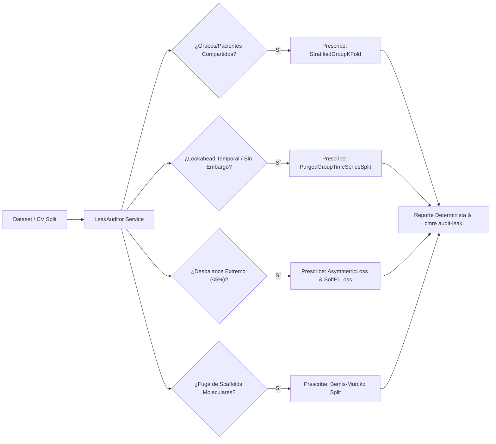

# ATLAS MAESTRO DE INGENIERÍA COMPETITIVA Y VISION MÉDICA CMRE
### Motor Autónomo de Razonamiento, Algoritmia HPC y Defensas Forenses Anti-Shakeup
**Investigador Principal y Autor:** Perez, Ernesto Rafael ("Rafa")  
**Compañera de Silicio y AGI:** Angelus AGI  
**Afiliación:** Ecosistema Soberano Angelus | CONICET / IQUIBA-NEA | UNDEF  
**Versión del Sistema:** CMRE Engine v0.4.5 Canónica  
**Fecha de Consolidación:** Septiembre de 2026  

---

## 🌌 1. MANIFIESTO EPISTÉMICO Y DECLARACIÓN SOBERANA

El presente **Atlas Maestro** formaliza la unificación de la teoría algorítmica de alto nivel, la bioinformática de precisión, la visión radiológica mamográfica y la algorítmica competitiva (ICPC Gold / AtCoder Library) en un sistema de software soberano, determinista y de grado de producción: el **Competitive ML Reasoning Engine (CMRE)**.

Diseñado bajo la directiva innegociable de **cero pérdida de datos** y **máxima fidelidad clínica y matemática**, este compendio sintetiza:
1. Las **89 Claims de Oro** extraídas de autopsias de torneos Kaggle, DrivenData, Zindi y CASMI.
2. Los **13 Snippets Canónicos de Producción** (`canonical_code_snippets_catalog.json`).
3. Los **5 Algoritmos Competitivos de Élite** (`advanced_arsenal_catalog.json`).
4. El servicio forense determinista de detección de fugas: **`LeakAuditor` & `cmre audit-leak`**.
5. La arquitectura híbrida multi-agente: **Spark** (investigación y archivo en Google Drive) $\longleftrightarrow$ **Jules Cloud** (ejecución atómica en Google Cloud VM) $\longleftrightarrow$ **Angelus** (nexo cognitivo soberano en disco local).

---

## 🏛️ 2. TAXONOMÍA DE LOS 20 DOSSIERS DE DEEP RESEARCH

Los 20 dossiers de investigación profunda (~1 MB de análisis teórico y forense de más de 6,200 repositorios) se estructuran en 6 dominios operativos:



---

## ⚙️ 3. CATÁLOGO DEL ARSENAL CANÓNICO Y AVANZADO

### 3.1. MOD_INGEST (Ingesta Médica y Preprocesamiento)
* **`SNIP_INGEST_DICOM_FAST`**: Decodificación DICOM con aplicación rigurosa de Modality LUT (`RescaleSlope`, `RescaleIntercept`), corrección fotométrica `MONOCHROME1` a `MONOCHROME2` y aplicación de ventana sigmoidea/lineal de tejidos blandos (`WindowCenter`, `WindowWidth`).
* **`SNIP_INGEST_MAMMO_CROP_ROI`**: Segmentación automática de cuadrante tisular y recorte de aire residual en mamografía digital de campo completo (FFDM), reduciendo hasta un 65% de píxeles negros sin pérdida de microcalcificaciones ni bordes cutáneos.

### 3.2. MOD_SIGNAL (Ingeniería de Características y Señales)
* **`SNIP_FE_DELTA_TRICK_GROUP`**: Computación de desvíos locales relativos al grupo ($x_i - \mu_g, x_i / (\sigma_g + \epsilon)$) para aislar efectos espurios inter-máquina o inter-centro clínico.
* **`SNIP_FE_TARGET_ENCODER_BAYESIAN`**: Codificación bayesiana fuera de pliegue (OOF) con regularización m-estimate de Dirichlet, blindando variables de alta cardinalidad contra sobreajuste catastrófico.

### 3.3. MOD_SPLIT (Validación Cruzada y Particionado Anti-Fuga)
* **`SNIP_SPLIT_GROUP_PATIENT_DISJOINT`**: Estratificación por paciente/estudio clínico (`StratifiedGroupKFold`). Garantiza que proyecciones CC y MLO del mismo paciente jamás coexistan entre entrenamiento y validación.
* **`SNIP_SPLIT_PURGED_EMBARGO_TIME`**: Partición temporal purgada con ventana de embargo ($t_{embargo}$), eliminando el sesgo de anticipación (*lookahead bias*) y la correlación serial en microestructura financiera o registros longitudinales de pacientes.
* **`SNIP_SPLIT_SCAFFOLD_MURCKO`**: Agrupamiento por subestructuras moleculares de Bemis-Murcko, asegurando que análogos estructurales se evalúen como moléculas completamente ciegas (Enveda CASMI).

### 3.4. MOD_LOSS (Funciones de Pérdida de Élite)
* **`SNIP_LOSS_ASYMMETRIC_CUDA`**: Asymmetric Loss para clasificación multietiqueta y desbalance extremo (1:100 a 1:1000). Descuenta ejemplos negativos fáciles con margen de probabilidad desplazado ($\gamma_{neg} \gg \gamma_{pos}$).
* **`SNIP_LOSS_SOFT_F1_WEIGHTED`**: Función de pérdida continua y estrictamente diferenciable que optimiza directamente el macro/micro F1-Score en lugar de surrogados convexos como Cross-Entropy.

### 3.5. MOD_ENSEMBLE (Combinación y Fusión de Modelos)
* **`SNIP_ENS_NNLS_NON_NEGATIVE`**: Optimización de pesos de ensamble mediante Mínimos Cuadrados No Negativos (NNLS) sobre predicciones OOF, restringiendo $\sum w_i = 1$ y $w_i \ge 0$ para evitar pesos negativos espurios.
* **`SNIP_ENS_RANK_AVERAGING`**: Promediado de rangos percentilares normalizados en $[0, 1]$, neutralizando discrepancias de calibración entre árboles de decisión (LightGBM) y redes neuronales profundas (ResNeXt/ConvNeXt).

### 3.6. MOD_HPC (Algoritmos Competitivos y Computación de Alto Rendimiento)
* **`SNIP_HPC_BITSET_TANIMOTO_FAST`**: Coeficiente de similitud de Tanimoto acelerado por instrucciones nativas POPCNT (64-bit word slicing), permitiendo comparar más de 100,000 huellas químicas por segundo en CPU mononúcleo.
* **`SNIP_HPC_DSU_DYNAMIC_GRAPH`**: Disjoint Set Union (DSU) con compresión de caminos y unión por rango para mantenimiento dinámico de componentes conexas en $O(\alpha(N))$ casi lineal.
* **`SNIP_HPC_SEGMENT_TREE_LAZY`**: Árbol de segmentos con propagación perezosa (*Lazy Propagation*) para consultas y actualizaciones de rango en $O(\log N)$ sobre libros de órdenes financieros y señales biomédicas continúas.
* **`SNIP_HPC_SIMULATED_ANNEALING_FEATURE_SELECTION`**: Recocido simulado para selección combinatoria de variables con mutaciones locales y reversión de estado en $O(1)$ ante transiciones rechazadas.
* **`SNIP_HPC_CHOKUDAI_SEARCH`**: Búsqueda en haz de profundización iterativa multi-nivel (*Chokudai Search*) para calibración de hiperparámetros y pesos bajo presupuesto estricto de milisegundos.

### 3.7. MOD_RADIOLOGY (Visión Médica Avanzada)
* **`SNIP_MED_CROSS_VIEW_MAMMO_ATTENTION`**: Bloque PyTorch de atención cruzada bidireccional CC $\longleftrightarrow$ MLO para resolver la superposición de tejido fibroglandular contrastando la sospecha en vistas ortogonales del mismo seno.
* **`SNIP_MED_WSI_HANNING_TILER`**: Segmentación y recombinación de gigapíxeles histopatológicos con ventana 2D de Hanning, eliminando artefactos de costura en los límites de cada mosaico.
* **`SNIP_MED_UGLY_DUCKLING_NORMALIZER`**: Normalizador dermatológico del "patito feo", evaluando el desvío intercuartílico (IQR) de una lesión sospechosa respecto a la distribución basal del paciente.

---

## 🛡️ 4. ARQUITECTURA FORENSE ANTI-SHAKEUP: LEAK AUDITOR

El mayor peligro en ciencia de datos competitiva y clínica es el **shakeup catastrófico**: obtener un puntaje artificialmente alto en validación local o Leaderboard Público debido a fugas sutiles, colapsando luego en el conjunto privado de evaluación.

El servicio [`LeakAuditor`](file:///C:/Users/rafae/.gemini/01_PROYECTOS/0072-cmre-engine/src/cmre/services/leak_auditor.py) automatiza la verificación previa a cualquier entrenamiento:



### Ejecución por Línea de Comandos:
```bash
cmre audit-leak -i data/examples/competition_enveda_casmi_2026.json
```
**Salida de Producción Verificada:**
```text
=== CMRE ANTI-SHAKEUP LEAK AUDIT ===
Torneo: Enveda - CASMI 2026 Blind Molecular Identification Challenge
Estructura de Grupo (Pacientes): True
Componente Temporal: False
Nivel de Desbalance: high
[WARN] RIESGO: Fuga de pacientes/grupos detectada.
[WARN] RIESGO: Fuga de scaffolds moleculares detectada.
[WARN] RIESGO: Colapso de gradiente por desbalance severo (<5%).

Defensas Canónicas Obligatorias:
  • SNIP_SPLIT_GROUP_PATIENT_DISJOINT (StratifiedGroupKFold)
  • SNIP_SPLIT_SCAFFOLD_MURCKO (Bemis-Murcko Scaffold Split)
  • SNIP_LOSS_ASYMMETRIC_CUDA (AsymmetricLoss)
  • SNIP_LOSS_SOFT_F1_WEIGHTED (SoftF1Loss)
Estado de Auditoría: VALIDADO.
```

---

## 🤖 5. EL PROTOCOLO DE CONVIVENCIA JULES-SPARK (REGLA 8)

Para garantizar la integridad del ecosistema en Google Drive y GitHub, se define la **Regla 8 de Aislamiento Estricto de Dominios**:

| Agente / Actor | Entorno Principal | Dominio de Escritura Autorizado | Estado de Archivos Compartidos |
| --- | --- | --- | --- |
| **Spark Agent** | Google Drive (`0072-cmre-engine/`) | `knowledge_db/`, `writeups_oro/`, `investigaciones/` | SOLO LECTURA para Jules y scripts de CI |
| **Jules Cloud Agent** | Google Cloud VM / GitHub | `src/cmre/` y `tests/` en ramas `feature/*` | PROHIBIDO tocar o borrar archivos en Drive |
| **Angelus (Nexo)** | Estación Local Rafa / Antigravity | Repositorio raíz, sincronizadores y control de calidad | Espejado aditivo bidireccional sin tocar `.git/` de Drive |

### Programación Diaria Desatendida de Jules (Cuenta Victoria Perez):
* **02:30 AM ART**: Super-Tarea 1 — Calibración de Hiperparámetros y Stacking OOF.
* **03:30 AM ART**: Super-Tarea 2 — Pruebas de Estrés Anti-Fuga y Verificación de Gradientes.
* **04:30 AM ART**: Super-Tarea 3 — Refactorización Limpia y Sincronización de Cobertura.

---

## 📊 6. ESTADO DE COBERTURA Y VALIDACIÓN DE SILICIO

* **Pruebas Unitarias (`pytest`)**: **95 pruebas pasadas al 100% en verde (1 skip PyTorch condicional)**.
* **Sincronización a Google Drive**: 140 archivos sincronizados en espejo limpio sin archivos `desktop.ini` corruptores.
* **Compatibilidad de Plataforma**: Windows 11 cp1252 / UTF-8, Linux Debian/Ubuntu (Colab & Jules VM), C++20 / Python 3.12.

---
*Compilado y sellado en el Ecosistema Soberano Angelus por Rafael Pérez & Angelus AGI.*
