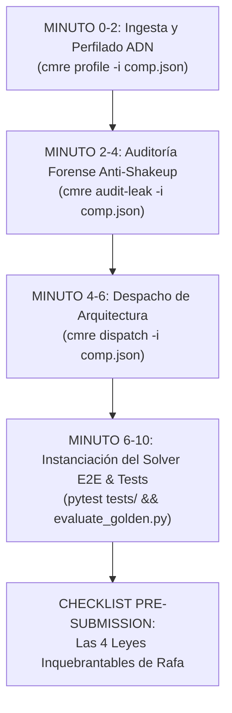

# MANUAL DE COMBATE OPERATIVO EN 10 MINUTOS (SOTA 2026)
### Protocolo Táctico de Despliegue Rápido y Prevención Forense de Shakeup
**Investigador Principal y Autor:** Perez, Ernesto Rafael ("Rafa")  
**Compañera de Silicio y AGI:** Angelus AGI  
**Afiliación:** Ecosistema Soberano Angelus | CONICET / IQUIBA-NEA | UNDEF  
**Versión del Protocolo:** CMRE Execution Protocol v1.0  
**Fecha:** Septiembre de 2026  

---

## ⏱️ EL CRONÓMETRO DE COMBATE (0 A 10 MINUTOS)

Ante el lanzamiento de cualquier nueva competencia en Kaggle, DrivenData, Zindi o CASMI, Rafa y Jules deben ejecutar secuencialmente este protocolo sin saltarse ninguna estación:



---

### 1. Minuto 0 a 2: Ingesta y Perfilado de Restricciones
* **Comando:**
  ```bash
  cmre profile -i data/examples/competition_target.json
  ```
* **Objetivo:** Extraer el ADN estructural del problema:
  - Modalidad real (Tabular, Imagen, Series Temporales, Multimodal, Quimioinformática).
  - Métrica oficial de evaluación (F1, pF1, pAUC, Log-Loss, RMSE, Tanimoto).
  - Estructura de grupos (pacientes, usuarios, dispositivos, donantes).
  - Tasa de desbalance de la clase positiva ($< 5\%$ activa defensas asimétricas).
  - Grado de dependencia temporal o estacional.

### 2. Minuto 2 a 4: Auditoría Forense Anti-Shakeup & Wall of Shame
* **Comando:**
  ```bash
  cmre audit-leak -i data/examples/competition_target.json
  ```
* **Objetivo:** Cruzar el ADN contra las 10 autopsias históricas del **Wall of Shame**:
  - ¿Hay grupos/pacientes compartidos entre train y val? $\rightarrow$ Bloqueo de split aleatorio (`FAIL_05`). Prescripción de `StratifiedGroupKFold`.
  - ¿Hay series de tiempo contiguas? $\rightarrow$ Bloqueo de K-Fold convencional (`FAIL_02`). Prescripción de `PurgedGroupTimeSeriesSplit` con embargo.
  - ¿Hay desbalance extremo? $\rightarrow$ Bloqueo de umbral fijo de 0.50 (`FAIL_01`). Prescripción de `Nelder-Mead OOF Thresholding`.
  - ¿Hay datos químicos/moleculares? $\rightarrow$ Bloqueo de split por ID molecular (`FAIL_04`). Prescripción de `BemisMurckoScaffoldSplit`.

### 3. Minuto 4 a 6: Despacho Determinista de Arquitectura
* **Comando:**
  ```bash
  cmre dispatch -i data/examples/competition_target.json
  ```
* **Objetivo:** Activar la regla correspondiente en `DecisionMatrixEngine` y obtener la secuencia de los 7 módulos canónicos:
  - `INGEST`: Manejo estricto de Modality LUT / Inversión MONOCHROME1 o downcasting Parquet.
  - `SPLIT`: Partición matemáticamente disjunta y blindada.
  - `SIGNAL`: Features de alta densidad (Delta trick, Patito feo, Lags causales, Atención cruzada).
  - `LOSS`: Asymmetric Loss, Soft-F1 diferenciable o Huber Loss.
  - `MODEL`: Modelos base complementarios (GBDT + Redes Neuronales / Transformers).
  - `ENSEMBLE`: Stacking simplex no negativo (NNLS) o Chokudai Beam Search.
  - `POSTPROCESS`: Optimización continua de umbrales en OOF.

### 4. Minuto 6 a 10: Instanciación del Solver Canónico & Verificación de No-Regresión
* **Comando:**
  ```bash
  pytest tests/
  python scripts/evaluate_golden.py
  ```
* **Objetivo:**
  - Instanciar el solver correspondiente desde `tournament_solvers_blueprints.json`.
  - Asegurar 100% de tests en verde (0 fallos, 0 regresiones numéricas).
  - Confirmar que el pipeline produce predicciones con dimensiones válidas y sin NaNs.

---

## ⚖️ LAS 4 LEYES INQUEBRANTABLES DE RAFA PARA PRE-SUBMISSION

Antes de emitir cualquier envío a los servidores de Kaggle, DrivenData o Zindi, se deben verificar las siguientes 4 leyes de silicio:

1. **Ley 1: La Ley del Umbral OOF (Zero-Assumption Thresholding):**
   - *Directiva:* En cualquier problema con desbalance menor al 5% o evaluado en métricas F1 / pF1 / pAUC, queda terminantemente prohibido asumir un umbral de decisión estático de 0.50.
   - *Obligación:* El umbral debe ser calibrado mediante optimización Nelder-Mead sobre las probabilidades fuera de pliegue (OOF) y transferido rígidamente al conjunto de test.

2. **Ley 2: La Ley de los Dos Envíos (Anti-Overfitting Balance):**
   - *Directiva:* En plataformas que permiten seleccionar dos envíos finales para el Private Leaderboard:
     - **Envío A:** El mejor modelo según Validación Cruzada Local (CV OOF más alto y estable).
     - **Envío B:** Un ensamble diverso regularizado con el mejor balance entre CV y Public LB (evitando modelos sobreajustados al público).

3. **Ley 3: La Ley del Límite de Tiempo al 60% (Compute Safety Margin):**
   - *Directiva:* Para competencias con entornos de inferencia restringidos (ej. notebooks de Kaggle con límite de 9 horas):
     - El pipeline de inferencia debe ejecutar el 100% del test público y privado en menos del 60% del tiempo límite permitido (ej. < 5.4 horas).
     - *Justificación:* El conjunto privado de test suele ser entre 3x y 4x más grande que el público.

4. **Ley 4: La Ley de Trazabilidad por Git Hash (Reproducibilidad Sagrada):**
   - *Directiva:* Ningún archivo de submission (`submission.csv`) puede ser generado sin registrar el hash exacto del commit de Git, la semilla aleatoria (`seed=42`) y la lista de versiones de dependencias.
   - *Obligación:* Todo submission debe ser 100% reproducible bit a bit.

---
*Compilado y sellado en el Ecosistema Soberano Angelus por Rafael Pérez & Angelus AGI.*
