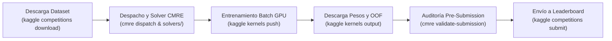

# 🥋 GUÍA MAESTRA: INGENIERÍA Y COMPETICIÓN EN KAGGLE VÍA CLI & BATCH
### Ecosistema: `0072-cmre-engine` (Competitive ML Reasoning Engine)
**Autor:** Perez, Ernesto Rafael ("Rafa") & Angelus AGI  
**Usuario de Kaggle Activo:** `ernestorafaelperez`  
**Fecha:** Septiembre de 2026  
**Aceleración Gratuita Semanal:** 30 horas GPU (Dual Tesla T4 / P100) + 20 horas TPU (v3-8)  

---

## 🔑 1. ESTADO DE AUTENTICACIÓN Y CONFIGURACIÓN DE TU CUENTA

Tu entorno en Windows ya se encuentra **100% configurado, enlazado y probado con éxito**:

* **Token Activo:** `C:\Users\rafae\.kaggle\kaggle.json` (Vigente y autenticado).
* **CLI Global:** `kaggle` se ejecuta directamente en cualquier terminal PowerShell o CMD.
* **Usuario:** `ernestorafaelperez`.
* **Cuota Semanal:**
  ```bash
  kaggle quota
  ```
  *(Se reinicia cada sábado a las 00:00 UTC con 30 horas completas de GPU).*

### 🔄 ¿Cómo renovar el token si algún día vence o cambias la contraseña?
1. Abre en tu navegador: [https://www.kaggle.com/settings](https://www.kaggle.com/settings).
2. Ve a la sección **API** (o pestaña **API Tokens**).
3. Haz clic en **Create New Token**. Se descargará automáticamente el archivo `kaggle.json`.
4. Muévelo a tu carpeta de usuario: `C:\Users\rafae\.kaggle\kaggle.json`.
5. ¡Listo! No requiere ningún reinicio.

---

## 📥 2. FLUJO DE TRABAJO 1: BÚSQUEDA, REGLAS Y DESCARGA DE DATOS

### Paso 2.1: Explorar torneos activos
```bash
# Listar competencias destacadas (Featured / Premio monetario)
kaggle competitions list --category featured

# Buscar por palabra clave (ej. medicina, visión, tiempo)
kaggle competitions list -s "mammography"
kaggle competitions list -s "melanoma"
```

### Paso 2.2: Aceptar las reglas (Obligatorio la primera vez)
Antes de descargar cualquier dataset de competencia, **debes abrir la web del torneo una sola vez** y hacer clic en **"I Understand and Accept"** en la pestaña *Rules*. De lo contrario, la API devolverá `403 Forbidden`.

### Paso 2.3: Listar y descargar el dataset
```bash
# Ver los archivos disponibles en el torneo
kaggle competitions files -c <competition-name>

# Descargar el dataset completo comprimido en una carpeta local
kaggle competitions download -c <competition-name> -p ./data/raw/<competition-name>
```

---

## 🚀 3. FLUJO DE TRABAJO 2: ENTRENAMIENTO EN LA NUBE CON GPU GRATIS (BATCH KERNELS)

No necesitas mantener el navegador abierto ni arriesgarte a que se corte el internet. Kaggle permite enviar scripts que corren en servidores de Google en segundo plano con **GPU Dual T4** o **TPU**:

### Paso 3.1: Estructura de la carpeta del Kernel
Crea una carpeta para el experimento, por ejemplo `experiments/exp01_rsna/`:
```text
experiments/exp01_rsna/
├── kernel-metadata.json   <-- Especificación del entorno
└── train_model.py         <-- Tu código fuente en Python
```

### Paso 3.2: El archivo `kernel-metadata.json`
```json
{
  "id": "ernestorafaelperez/cmre-rsna-mammography-exp01",
  "title": "CMRE RSNA Mammography Exp01",
  "code_file": "train_model.py",
  "language": "python",
  "kernel_type": "script",
  "is_private": true,
  "enable_gpu": true,
  "enable_tpu": false,
  "enable_internet": true,
  "dataset_sources": [],
  "competition_sources": ["rsna-screening-mammography-detection"],
  "kernel_sources": []
}
```

* **`enable_gpu: true`:** Asigna GPU NVIDIA Tesla T4 o P100 sin costo.
* **`competition_sources`:** Kaggle monta automáticamente los datos del torneo en `/kaggle/input/<competition-name>/`.
* **`enable_internet: true`:** Permite instalar paquetes con `pip install timm monai` dentro de Kaggle.

### Paso 3.3: Lanzar la ejecución a la nube
```bash
# Empuja y dispara el entrenamiento en segundo plano
kaggle kernels push -p ./experiments/exp01_rsna
```

### Paso 3.4: Monitorear el progreso en tiempo real
```bash
# Ver el estado: queued -> running -> complete (o error)
kaggle kernels status ernestorafaelperez/cmre-rsna-mammography-exp01
```

### Paso 3.5: Descargar los pesos entrenados y métricas
Al terminar la ejecución, todo lo que tu script haya guardado en el directorio de trabajo (`/kaggle/working/`) se descarga con un solo comando:
```bash
kaggle kernels output ernestorafaelperez/cmre-rsna-mammography-exp01 -p ./models_checkpoint/
```

---

## 📤 4. FLUJO DE TRABAJO 3: VALIDACIÓN ESTRICTA Y ENVÍO DE SUBMISSION

Una vez que tu pipeline genera `submission.csv`, aplicamos el **Protocolo de Batalla de Rafa**:

### Paso 4.1: Auditoría previa con el Guardián Pre-Submission
```bash
# Comprueba columnas, cotas [0, 1], nulos, infinitos y orden exacto 1-a-1 de IDs
cmre validate-submission -s submission.csv -ref data/raw/sample_submission.csv -t data/raw/test.csv -d probability
```
*Si el validador emite `[PASS]`, la submission está blindada contra errores tontos y cero-scores.*

### Paso 4.2: Enviar al Leaderboard de Kaggle
```bash
kaggle competitions submit -c <competition-name> -f submission.csv -m "CMRE v0.4.0 AsymmetricLoss OOF Fold0-4 [Hash: d35487b]"
```

### Paso 4.3: Consultar el puntaje obtenido y estado de evaluación
```bash
# Muestra el estado del envío (pending -> complete), Public Score y fecha
kaggle competitions submissions -c <competition-name>
```

---

## 🔒 5. FLUJO DE TRABAJO 4: COMPETENCIAS "CODE-ONLY" (INFERENCIA OCULTA)

En las competencias modernas más importantes (como *RSNA Mammography*, *ISIC Melanoma*, *HuBMAP*), los organizadores **no te permiten subir un archivo CSV**, sino que exigen que envíes un **Notebook de Kaggle que corra sobre un Test Set privado oculto** dentro de un límite estricto de tiempo (ej. 9 horas) y **sin acceso a internet**.

### Reglas de Oro para Torneos Code-Only:
1. **Subir los Pesos como Kaggle Dataset:**
   * Entrenas localmente o en Colab/Kaggle Batch.
   * Empaquetas los pesos (`model_fold0.pt`, etc.) y los subes a Kaggle como Dataset privado:
     ```bash
     kaggle datasets create -p ./weights_folder
     ```
2. **Notebook de Inferencia Autónomo:**
   * En `kernel-metadata.json`, configuras:
     ```json
     {
       "enable_gpu": true,
       "enable_internet": false,
       "dataset_sources": ["ernestorafaelperez/mis-pesos-modelo-cmre"],
       "competition_sources": ["rsna-screening-mammography-detection"]
     }
     ```
3. **Manejo del Dummy Test:**
   * En el entorno interactivo de Kaggle, `test.csv` solo tiene 3 o 4 filas ficticias (dummy).
   * Cuando presionas "Submit", Kaggle reemplaza silenciosamente `test.csv` por el verdadero conjunto oculto (con miles de imágenes).
   * Tu código debe iterar de forma dinámica sobre las filas que existan sin asumir un tamaño fijo.
4. **La Ley del 60% de Tiempo de Rafa:**
   * Si el torneo da 9 horas de límite, tu inferencia sobre el volumen estimado del test set no debe exceder de 5.4 horas para evitar un trágico *Time Limit Exceeded (TLE)*.

---

## 💻 6. CHEATSHEET DE COMANDOS RÁPIDOS DE KAGGLE CLI

| Tarea | Comando CLI |
| :--- | :--- |
| **Ver cuota de GPU/TPU** | `kaggle quota` |
| **Ver usuario y configuración** | `kaggle config view` |
| **Listar competencias activas** | `kaggle competitions list` |
| **Descargar datos de competencia** | `kaggle competitions download -c <torneo> -p <destino>` |
| **Listar submissions enviadas** | `kaggle competitions submissions -c <torneo>` |
| **Enviar submission con mensaje** | `kaggle competitions submit -c <torneo> -f <archivo.csv> -m "<mensaje>"` |
| **Listar mis kernels/notebooks** | `kaggle kernels list --mine` |
| **Subir e iniciar ejecución remota** | `kaggle kernels push -p <directorio_con_metadata>` |
| **Ver estado de ejecución** | `kaggle kernels status <usuario>/<kernel-slug>` |
| **Descargar resultados de kernel** | `kaggle kernels output <usuario>/<kernel-slug> -p <destino>` |
| **Crear un nuevo Dataset** | `kaggle datasets create -p <directorio>` |

---

## 🏆 7. RESUMEN: EL CICLO COMPLETO CON EL ECOSISTEMA CMRE



Con esta arquitectura, tienes el poder de cómputo en la nube de Google Kaggle, la validación local anti-shakeup de Angelus y el control total desde tu consola sin depender de interfaces lentas.
